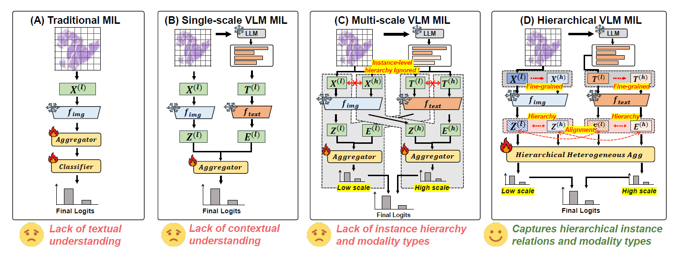
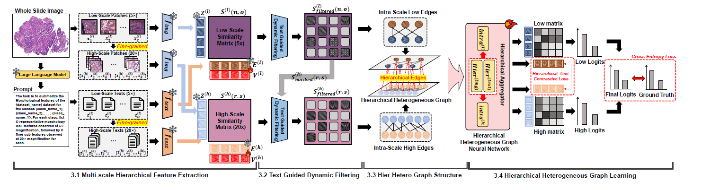

<h1 align="center">[NeurIPS 2025] Few-Shot Learning from Gigapixel Images via Hierarchical Vision-Language Alignment and Modeling</h1>

<p align="center">
  <a href="https://arxiv.org/abs/2505.17982">
    
  </a>
  <a href="https://openreview.net/forum?id=ZC2rbIYWfy">
    
  </a>
  <a href="https://neurips.cc/virtual/2025/loc/san-diego/poster/117369">
    
  </a>
</p>

## 📣 Updates

* **2025.12.16** — Released interpretability analysis code.
* **2025.11.24** — Released all preprocessed WSI features, full codebase, and instructions for running HiVE-MIL.
* **2025.09.18** — Our **HiVE-MIL** has been accepted at **NeurIPS 2025**! 🔥🎉
* **2025.05.16** — Released the initial code submission.

## 🚀 Overview

We propose **HiVE-MIL** (**Hi**erarchical **V**ision-Languag**E MIL**), a data-efficient VLM adaptation framework for gigapixel WSIs that models **hierarchical interactions** and **intra-scale vision–language alignments**, enabling robust few-shot WSI classification and interpretable predictions.

<p align="center">
  
</p>


### Why HiVE-MIL?
- WSIs are gigapixel-scale and have a **hierarchical structure** (e.g., 5x → 20x).  
- Traditional MIL requires **large labeled WSI datasets**, which are limited by **privacy** and **rare-disease scarcity** and it learns only from the original slides, leading to **staining variability** and **domain shift**.  
- Existing Vision-Language MIL incorporates text as domain knowledge but still lacks **explicit hierarchy modeling** and **robust multimodal alignment**.


<p align="center">
  
</p>

### What HiVE-MIL Introduces
- **Cross-scale hierarchical interaction**
  - **Hierarchical Graph:** Constructs parent–child edges between 5x and 20x visual/text nodes.
  - **Hierarchical Text Contrastive Loss (HTCL):** Enforces semantic consistency across scales.
- **Intra-scale multimodal interaction**
  - **Heterogeneous Graph:** Models image–text relationships within each scale.
  - **Text-Guided Dynamic Filtering (TGDF):** Selects informative patch–text pairs while suppressing weak or irrelevant ones during training.

Together, these components enable HiVE-MIL to capture **hierarchical and semantic dependencies across scales and modalities**, delivering strong few-shot performance and interpretable predictions across multiple WSI benchmarks.

## 🛠 Getting Started
### 1. Set Up the Environment

Set up your environment with these simple steps:

```bash
# Create and activate environment
conda create --name hivemil python=3.9.21
conda activate hivemil
conda install pytorch==2.3.0 torchvision==0.18.0 pytorch-cuda=11.8 -c pytorch -c nvidia

# Install dependencies
git clone https://github.com/bryanwong17/HiVE-MIL.git
cd HiVE-MIL
pip install -r requirements.txt
pip install torch_sparse -f https://data.pyg.org/whl/torch-2.3.0+cu118.html
pip install topk@git+https://github.com/oval-group/smooth-topk.git@12c1645f187e2fa0c05f47bf1fe48864d4bd2707
```

### 2. Download Dataset

The public TCGA datasets can be downloaded from the [NIH Genomic Data Commons Data Portal](https://portal.gdc.cancer.gov/). For the specific downloading tool, please refer to [GDC Data Transfer.](https://docs.gdc.cancer.gov/Data_Transfer_Tool/Users_Guide/Data_Download_and_Upload/) 

### 3. Prepare a Dataset CSV File

For each dataset, a `.csv` file is needed in the following format and put it into the `dataset_csv` folder:

```
Headname: 'case_id, slide_id, label, level0_mag'
Each line: 'patient_0, TCGA-A7-A26I-01Z-00-DX1.0077D012-BC14-4E96-84F7-A1A6A3A778DF, IDC, 40'
```

For reference, we provide example files in the `dataset_csv` folder.

### 4. Data Preparation

### 4.1 Download Preprocessed Hierarchical WSI Features (Recommended)

To reproduce our results, download the preprocessed hierarchical WSI features (~20 - 25 GB) using the links below.

---

### **TCGA BRCA (Breast Cancer)** — IDC vs. ILC  
| Feature extractor | Download link |
|-------------------|---------------|
| [PLIP](https://github.com/PathologyFoundation/plip) | [tcga_brca_plip.zip](https://drive.google.com/file/d/1o380mpLnz1cOPZMZqkdhxDXmEfA0i3NM/view?usp=sharing) |
| [QuiltNet](https://github.com/wisdomikezogwo/quilt1m) | [tcga_brca_quiltnet.zip](https://drive.google.com/file/d/1v36TV95CXPVFc2nxwjKVOLsKw3Y73Ldt/view?usp=sharing) |
| [CONCH](https://github.com/mahmoodlab/CONCH) | [tcga_brca_conch.zip](https://drive.google.com/file/d/1-XPds-m3lpJPJioYymeqQFyy4QrzyRS6/view?usp=sharing) |

---

### **TCGA NSCLC (Lung Cancer)** — LUAD vs. LUSC  
| Feature extractor | Download link |
|-------------------|---------------|
| [PLIP](https://github.com/PathologyFoundation/plip) | [tcga_nsclc_plip.zip](https://drive.google.com/file/d/18dN7-35kxknO_UxdWDjUMLrFoQCCyBue/view?usp=sharing) |
| [QuiltNet](https://github.com/wisdomikezogwo/quilt1m) | [tcga_nsclc_quiltnet.zip](https://drive.google.com/file/d/1r32uTYBTsj0bPIOICRzzalWDB-V5rwHA/view?usp=sharing) |
| [CONCH](https://github.com/mahmoodlab/CONCH) | [tcga_nsclc_conch.zip](https://drive.google.com/file/d/1pW3PUl703E1h3TPA2jqKbqCZfgZ8pRta/view?usp=sharing) |

---

### **TCGA RCC (Kidney Cancer)** — CCRCC vs. PRCC vs. CHRCC  
| Feature extractor | Download link |
|-------------------|---------------|
| [PLIP](https://github.com/PathologyFoundation/plip) | [tcga_rcc_plip.zip](https://drive.google.com/file/d/14s-W2HJA3wL4oirisIZ4kEvwiwmiXdF9/view?usp=sharing) |
| [QuiltNet](https://github.com/wisdomikezogwo/quilt1m) | [tcga_rcc_quiltnet.zip](https://drive.google.com/file/d/1X_w2_LWjBQJiTdzncObQ7UJiZyxtUp3y/view?usp=sharing) |
| [CONCH](https://github.com/mahmoodlab/CONCH) | [tcga_rcc_conch.zip](https://drive.google.com/file/d/1ZDo7FZ_sWd7WUgzVEma4RGEtQaorJgY9/view?usp=sharing) |


To unzip the downloaded the file  (e.g., `tcga_brca_quiltnet.zip`), use the following command:

```
unzip tcga_brca_quiltnet.zip
```

After extraction, the folder structure should look like this:
```text
DATASET_ROOT/
└── tcga_brca_quiltnet/
    ├── quiltnet_5x/
    │   ├── slide_a.h5
    │   ├── slide_b.h5
    │   └── ...
    └── hierarchical_quiltnet_5x_20x/
        ├── slide_a.h5
        ├── slide_b.h5
        └── ...
```

For each slide (e.g., `slide_a`), the feature files are:

- `quiltnet_5x/slide_a.h5`: **5x patch features**, shape `[#5x_patches, feat_dim]`
- `hierarchical_quiltnet_5x_20x/slide_a.h5`: **5x→20x hierarchical features**, shape `[#5x_patches, 16, feat_dim]`

> **Note:** In the parent–child hierarchy, each 5x patch corresponds to up to 16 20x child patches. Missing children are zero-padded.


### 4.2 Construct Hierarchical Features (Optional)

To generate hierarchical features, you must first extract both **5x** and **20x** patch features. You can follow the preprocessing pipeline from [**ViLa-MIL**](https://github.com/Jiangbo-Shi/ViLa-MIL), which includes:

- generate patch coordinate  
- crop patches 
- extract patch features 

After running all preprocessing steps (e.g., for the **tcga_brca** dataset using **quiltnet**), your directory should include the `quiltnet_5x` and `quiltnet_20x` folders with the following structure:

```text
DATASET_ROOT/
└── tcga_brca_quiltnet/
    ├── quiltnet_5x/
    │   ├── slide_a.h5
    │   ├── slide_b.h5
    │   └── ...
    └── quiltnet_20x/
        ├── slide_a.h5
        ├── slide_b.h5
        └── ...
```
For each WSI (e.g., `slide_a`), the extracted feature files should be:

- `quiltnet_5x/slide_a.h5`: **5x patch features**, shape `[#5x_patches, feat_dim]`
- `quiltnet_20x/slide_a.h5`: **20x patch features**, shape `[#20x_patches, feat_dim]`


Next, construct the hierarchical 5x→20x features by linking patches via their absolute coordinates:

```bash
python create_hierarchical_features.py \
  --dataset-root-path DATASET_ROOT \
  --dataset-name DATASET_NAME \
  --feature-extractor-name FEATURE_EXTRACTOR_NAME \
  --low-mag 5 \
  --high-mag 20 \
  --max-patches 16
```

**Parameter Descriptions:**

- `dataset-root-path`: Path to the directory containing the extracted 5x and 20x feature folders.  
- `dataset-name`: Name of the dataset to process (e.g., `tcga_brca`, `tcga_nsclc`, `tcga_rcc`).  
- `feature-extractor-name`: Feature extractor used to generate patch embeddings (e.g., `quiltnet`, `plip`, `conch`).  
- `low-mag`: Low magnification level used for parent patches (e.g., `5x`).  
- `high-mag`: High magnification level used for child patches (e.g., `20x`).  
- `max-patches`: Maximum number of 20x child patches linked to each 5x parent patch. (Default: `(high_mag / low_mag)^2`, e.g., `(20 / 5)^2 = 16`).

To verify that each 5x patch correctly aligns with its corresponding 20x child patches, run:

```bash
python check_hierarchical_consistency.py \
  --dataset-root-path DATASET_ROOT \
  --dataset-name DATASET_NAME \
  --feature-extractor-name FEATURE_EXTRACTOR_NAME
```

**Parameter Descriptions:**

- `dataset-root-path`: Path to the directory containing the extracted 5x and 20x feature folders.  
- `dataset-name`: Name of the dataset to process (e.g., `tcga_brca`, `tcga_nsclc`, `tcga_rcc`).  
- `feature-extractor-name`: Feature extractor used to generate patch embeddings (e.g., `quiltnet`, `plip`, `conch`).

### 5. Split Datasets

You can follow the split datasets steps from [**ViLa-MIL**](https://github.com/Jiangbo-Shi/ViLa-MIL), which includes:
- generate `k` splitting datasets with different seeds  
- build the few-shot dataset split

For reproducibility, we also provide the splits used in our main experiments (16-shot) in the `splits` folder

### 6. Prepare Text Prompt

HiVE-MIL uses a frozen LLM to generate hierarchical morphological descriptions for each class in the dataset.

The prompt used for generating these descriptions is:

```text
The task is to summarize the morphological features of the {dataset_name} dataset for the classes {class_name_1}, {class_name_2}, ..., {class_name_c} classes. For each class, list four representative morphological features observed at 5x magnification, followed by three finer sub-features observed at 20x magnification for each. Each description should include the morphological term along with an explanation of its defining visual features.
```

The generated structure follows these rules:

- The **first four entries** correspond to coarse-scale (5x) morphological features.  
- Each 5x feature is **expanded into three fine-scale (20x) sub-features**, providing more detailed morphological descriptions.

For reproducibility, all generated hierarchical descriptions are included in the `text_prompt` directory, produced using `GPT-4o`.

### 7. Training Model

To use `conch` as the feature extractor, download the pre-trained conch model from the following link: [pytorch_model.bin](https://drive.google.com/file/d/1G5QHdsWMLsuyzaeAFBgkakuNQm_teOVD/view?usp=sharing) and place this file in `conch/pytorch_model.bin`.

Once everything is set up, run the following script to train HiVE-MIL.

```
python main.py \
  --seed 1 \
  --drop_out \
  --early_stopping \
  --lr 1e-4 \
  --k 5 \
  --few_shot_num 16 \
  --feature_extractor FEATURE_EXTRACTOR_NAME \
  --feature_dim 512 \
  --bag_loss ce \
  --task TASK \
  --results_dir RESULT_DIR \
  --model_type HiVE_MIL \
  --data_root_dir DATASET_ROOT \
```

Parameter Descriptions:

* `seed`: Random seed used to ensure reproducibility across training runs (Default: `1`).
* `drop_out`: Enables dropout during training to improve model generalization (Default: `True`).
* `early_stopping`: Activates early stopping based on validation performance to prevent overfitting (Default: `True`).
* `lr`: Learning rate used by the optimizer (Default: `1e-4`).
* `k`: Number of few-shot splits (Default: `5`).
* `few_shot_num`: Number of labeled samples per class used in the few-shot training setting (Default: `16`).
* `feature_extractor`: Feature extractor used for training (e.g., `quiltnet`, `plip`, `conch`).
* `feature_dim`: Dimensionality of the extracted patch features (Default: `512`).
* `bag_loss`: Loss function applied at the bag level for MIL training (Default: `ce`).
* `task`: Name of the dataset to be used for training (e.g., `tcga_brca`, `tcga_nsclc`, `tcga_rcc`).
* `results_dir`: Directory where training outputs and results will be saved.
* `model_type`: Model architecture used for training (Default: `HiVE_MIL`).
* `data_root_dir`: Path to the directory containing the extracted 5x and 20x feature folders.

After training, you can check the mean and standard deviation of ACC, AUC, and Macro F1 across the few-shot splits in the `results.csv` file, located in the `RESULT_DIR` folder. These values should closely match the main results reported in **Table 1** of the paper.

### 8. Interpretability Analysis

Please refer to `interpretability_analysis.ipynb`, which provides interpretable evidence based on the description of the contributing text descriptions (5x and 20x)

## Citation

If you find our work useful in your research, please consider starring 🌟 this repo and citing our [paper](https://arxiv.org/abs/2505.17982) at:

```
@article{wong2025few,
  title={Few-Shot Learning from Gigapixel Images via Hierarchical Vision-Language Alignment and Modeling},
  author={Wong, Bryan and Kim, Jong Woo and Fu, Huazhu and Yi, Mun Yong},
  journal={arXiv preprint arXiv:2505.17982},
  year={2025}
}
```

## Acknowledgements

This project is based on [ViLa-MIL](https://github.com/Jiangbo-Shi/ViLa-MIL), [CLAM](https://github.com/mahmoodlab/CLAM), [CoOp](https://github.com/KaiyangZhou/CoOp), [PLIP](https://github.com/PathologyFoundation/plip), [QuiltNet](https://github.com/wisdomikezogwo/quilt1m), and [CONCH](https://github.com/mahmoodlab/CONCH). We sincerely thank the authors of these excellent works.

## Contact
If you have any questions, feedback, or issues regarding this project, please reach out to us via email: [bryan.wong@kaist.ac.kr](bryan.wong@kaist.ac.kr) or open an issue on GitHub.